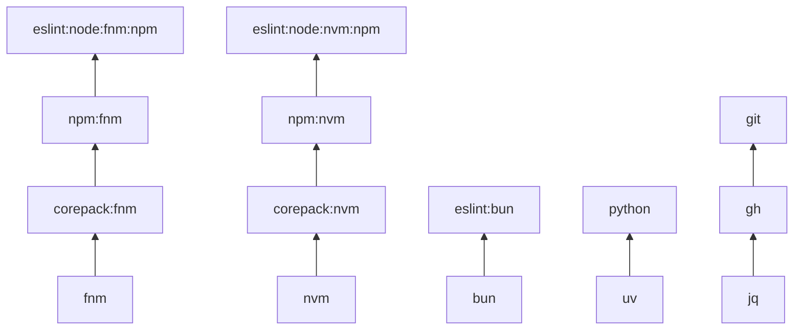

# TaskOtter

[](https://github.com/task-otter/store/actions/workflows/main.yml)
[](https://codecov.io/gh/task-otter/store)

Reusable, tested [Taskfile](https://taskfile.dev) modules for installing and running common dev tools. Each module lives under `taskfiles/<name>/` with a `Taskfile.yml`, `metadata.yml`, `README.md`, and Go tests.

## Quick start

### Standalone

```sh
task -t taskfiles/go/Taskfile.yml install
task -t taskfiles/go/Taskfile.yml verify
```

### Included in your Taskfile

```yaml
includes:
  go: ./taskfiles/go/Taskfile.yml
```

Then run:

```sh
task go:install
task go:verify
```

## Tools catalog

| Category | Modules | Count | Example |
| --- | --- | ---: | --- |
| Node runtimes | `fnm`, `nvm`, `bun` | 3 | [`fnm`](taskfiles/fnm/README.md) |
| Package managers | `npm`, `pnpm`, `yarn`, `corepack` — each a nested family with 2 leaves (`{fnm,nvm}`) | 8 | [`npm`](taskfiles/npm/README.md) |
| JS lint/format/check | `biome`, `bruno`, `depcheck`, `eslint`, `knip`, `prettier`, `stylelint`, `typescript` — each a nested family with 7 leaves (`bun`, `node/{fnm,nvm}/{npm,pnpm,yarn}`) | 56 | [`eslint`](taskfiles/eslint/README.md) |
| Languages & runtimes | `go`, `golangci-lint`, `govulncheck`, `python`, `uv`, `cargo`, `proto`, `pulumi` | 9 | [`go`](taskfiles/go/README.md) |
| CI & infra | `actionlint`, `bencher`, `shellcheck`, `shfmt`, `yamllint`, `zizmor`, `hadolint`, `buf`, `docker`, `git`, `gh`, `jq`, `vault`, `ansible`, `sqlfluff`, `dotenv-linter`, `htmlhint`, `djlint`, `jsonlint`, `rumdl`, `protolint`, `spectral`, `adrs` | 30 | [`actionlint`](taskfiles/actionlint/README.md) |

**104 modules** total. Per-module docs: `taskfiles/<name>/README.md`. Each module's
`metadata.yml` is a self-contained, machine-readable list of the tasks it exports.

Direct linter and formatter modules expose an empty-by-default
`<TOOL>_LINT_SKIP_PATTERN` and/or `<TOOL>_FMT_SKIP_PATTERN`. Patterns are
matched against forward-slash paths relative to the task working directory;
`*` stays within a path segment, `**` crosses directories, and `?` matches one
character. For example, `**/generated/**` skips generated files in any folder.

### Choosing a variant

Each JavaScript tool is a nested family. Include the family once
(`{tool}: taskfiles/{tool}/Taskfile.yml`), then invoke the leaf that matches your
runtime and package manager through its namespace:

```
task {tool}:bun:{task}                        # Bun runtime + Bun as package manager
task {tool}:node:{fnm|nvm}:{npm|pnpm|yarn}:{task}
```

For example: `task eslint:node:fnm:npm:lint`, `task prettier:bun:fmt:check`,
`task typescript:node:nvm:pnpm:build`. (`htmlhint` and `spectral` omit the `bun`
and `yarn` leaves.)

Package-manager modules are nested families too, keyed by node version manager.
Include the family once (`npm: taskfiles/npm/Taskfile.yml`), then invoke the leaf
matching your stack:

```
task {npm|pnpm|yarn|corepack}:{fnm|nvm}:{task}
```

For example: `task npm:fnm:install`, `task pnpm:nvm:ci`, `task corepack:fnm:setup`.

## Dependencies

Modules compose via Taskfile `includes:`. A JS tool variant typically depends on a package-manager module, which in turn depends on a Node runtime stack.



See [deps-tree.md](deps-tree.md) for the complete dependency graph (forward and reverse views).

Keep [deps-tree.md](deps-tree.md) in sync when editing [`.deps.yml`](.deps.yml).

## Development

Validate all modules:

```sh
go test ./...
```

Each module README must include a `## Public Tasks` table listing every public task from its `Taskfile.yml`. Tests enforce this contract — run `go test ./...` after changing Taskfiles or READMEs.

After adding, removing, or renaming an exported task, update the corresponding
`metadata.yml` and run `go test ./...`.

Top-level Taskfile vars must use an owned `{TOOL}_` prefix (or a
foreign/companion prefix); see
[doc/adr/0002-prefix-top-level-taskfile-vars-with-the-module-name.md](doc/adr/0002-prefix-top-level-taskfile-vars-with-the-module-name.md).
