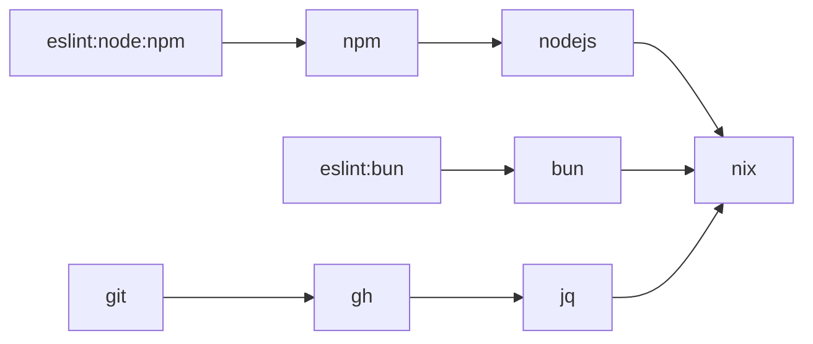

# TaskOtter

[](https://github.com/task-otter/store/actions/workflows/main.yml)
[](https://codecov.io/gh/task-otter/store)

Reusable, tested [Taskfile](https://taskfile.dev) modules for installing and
running common dev tools. Clone or submodule this repo, include a module, and
run it — the CLI is installed automatically.

Each module lives under `taskfiles/<name>/` with a `Taskfile.yml`,
`metadata.yml`, `README.md`, and Go tests. **94 modules** in total.

## Requirements

- [Task](https://taskfile.dev) 3.5+
- Linux, macOS, or Windows WSL2 (native Windows cannot auto-install via Nix)

Nix itself is bootstrapped by the [`nix`](taskfiles/nix/README.md) module on
first use. Keep the `taskfiles/` tree intact so relative `includes:` resolve.

## Quick start

Include a module in your Taskfile:

```yaml
includes:
  go: ./taskfiles/go/Taskfile.yml
```

Then run it. Work tasks auto-install the tool through `nix:install:profile`:

```sh
task go:verify
```

Standalone, from this repo:

```sh
task -t taskfiles/go/Taskfile.yml verify
```

Per-module docs and public tasks: `taskfiles/<name>/README.md`.

## How install works

Most CLI modules have no public `install` task. They depend on
[`nix:install:profile`](taskfiles/nix/README.md), which adds a flake
installable to `~/.nix-profile`. Pin with `{TOOL}_NIX_INSTALLABLE`:

```sh
task go:verify GO_NIX_INSTALLABLE=github:NixOS/nixpkgs/<rev>#go
```

Install without running the work task (needs a root `nix` include, or the
nested `*:nix:` namespace):

```yaml
includes:
  nix: ./taskfiles/nix/Taskfile.yml
```

```sh
task nix:install:profile NIX_INSTALLABLE=nixpkgs#go
```

Install surfaces:

| Kind | Modules | Install surface |
| --- | --- | --- |
| Nix profile (default) | CLI and system tools | `{TOOL}_NIX_INSTALLABLE` → `nix:install:profile` |
| Local `devDependency` | JS lint/format families | `{TOOL}_VERSION` on `install` / `upgrade` |
| Project package managers | [`npm`](taskfiles/npm/README.md), [`pnpm`](taskfiles/pnpm/README.md), [`yarn`](taskfiles/yarn/README.md) | project `install` (`npm install`, …); the CLIs come from Nix |
| Docker daemon | [`docker`](taskfiles/docker/README.md) | keeps `install` / `upgrade` / `version` (Docker Desktop / get.docker.com) |

See [ADR 0004](doc/adr/0004-install-cli-tools-via-nix-profile.md).

## Catalog

| Category | Modules |
| --- | --- |
| Node runtimes | [`nodejs`](taskfiles/nodejs/README.md), [`bun`](taskfiles/bun/README.md) |
| Package managers | [`npm`](taskfiles/npm/README.md), [`pnpm`](taskfiles/pnpm/README.md), [`yarn`](taskfiles/yarn/README.md) |
| JS lint / format / check | [`biome`](taskfiles/biome/README.md), [`depcheck`](taskfiles/depcheck/README.md), [`eslint`](taskfiles/eslint/README.md), [`htmlhint`](taskfiles/htmlhint/README.md), [`knip`](taskfiles/knip/README.md), [`prettier`](taskfiles/prettier/README.md), [`spectral`](taskfiles/spectral/README.md), [`stylelint`](taskfiles/stylelint/README.md), [`typescript`](taskfiles/typescript/README.md) |
| Languages & runtimes | [`go`](taskfiles/go/README.md), [`go-junit-report`](taskfiles/go-junit-report/README.md), [`golangci-lint`](taskfiles/golangci-lint/README.md), [`govulncheck`](taskfiles/govulncheck/README.md), [`python`](taskfiles/python/README.md), [`uv`](taskfiles/uv/README.md), [`cargo`](taskfiles/cargo/README.md), [`proto`](taskfiles/proto/README.md), [`pulumi`](taskfiles/pulumi/README.md), [`nix`](taskfiles/nix/README.md) |
| CI & infra | [`actionlint`](taskfiles/actionlint/README.md), [`adrs`](taskfiles/adrs/README.md), [`ansible`](taskfiles/ansible/README.md), [`ansible-lint`](taskfiles/ansible-lint/README.md), [`bencher`](taskfiles/bencher/README.md), [`bruno-cli`](taskfiles/bruno-cli/README.md), [`buf`](taskfiles/buf/README.md), [`djlint`](taskfiles/djlint/README.md), [`docker`](taskfiles/docker/README.md), [`dotenv-linter`](taskfiles/dotenv-linter/README.md), [`gh`](taskfiles/gh/README.md), [`git`](taskfiles/git/README.md), [`hadolint`](taskfiles/hadolint/README.md), [`jq`](taskfiles/jq/README.md), [`jsonlint`](taskfiles/jsonlint/README.md), [`protolint`](taskfiles/protolint/README.md), [`rumdl`](taskfiles/rumdl/README.md), [`shellcheck`](taskfiles/shellcheck/README.md), [`shfmt`](taskfiles/shfmt/README.md), [`sqlfluff`](taskfiles/sqlfluff/README.md), [`vault`](taskfiles/vault/README.md), [`yamlfix`](taskfiles/yamlfix/README.md), [`yamllint`](taskfiles/yamllint/README.md), [`zizmor`](taskfiles/zizmor/README.md) |
| Desktop | [`bruno-gui`](taskfiles/bruno-gui/README.md) |

Each JS family is six modules (root, `bun`, `node`, and `node/{npm,pnpm,yarn}`)
— 54 of the 94. `metadata.yml` lists the tasks a module exports.

### JS variants

Include the family once, then invoke the leaf that matches your runtime and
package manager:

```yaml
includes:
  eslint: ./taskfiles/eslint/Taskfile.yml
```

```sh
task eslint:bun:{task}                 # Bun runtime + Bun as package manager
task eslint:node:{npm|pnpm|yarn}:{task}
```

Examples: `task eslint:node:npm:ci`, `task prettier:bun:fmt:check`,
`task typescript:node:pnpm:build`.

Package-manager modules are flat and nix-backed:

```sh
task npm:install
task pnpm:install:clean
task yarn:run SCRIPT=build
```

Node.js is installed via `nodejs:_ensure` (Nix profile).

### Skip patterns

Where a module documents `<TOOL>_LINT_SKIP_PATTERN` and/or
`<TOOL>_FMT_SKIP_PATTERN`, those vars default to empty. Not every linter
exposes them — skip is owned by native `--exclude` on the modules that
document it.

Patterns match forward-slash paths relative to the task working directory:
`*` stays in one path segment, `**` crosses directories, `?` matches one
character. Example: `**/generated/**`.

## Dependencies

Modules compose via Taskfile `includes:`. Arrows mean "depends on":



Full graph (forward and reverse): [deps-tree.md](deps-tree.md). Keep it in
sync with [`.deps.yml`](.deps.yml).

## Development

```sh
go test ./...
```

Two test layers on every Taskfile folder:

| Layer | File | Checks |
| --- | --- | --- |
| Contract | `<module>_test.go` | What the module *declares* (`Taskfile.yml`, `metadata.yml`, `README.md`) |
| Integration | `integration_test.go` | What the module *does* — real `task` CLI, isolated `HOME`, nothing installed |

The integration file is one call into
[`internal/taskintegration`](internal/taskintegration):

```go
func TestModuleIntegration(t *testing.T) {
	t.Parallel()
	taskintegration.RunHere(t)
}
```

`TestEveryTaskfileFolderHasAnIntegrationTest` fails if a folder ships without
one. Details: [ADR 0003](doc/adr/0003-run-every-taskfile-folder-through-the-task-cli-in-tests.md).

Contract tests also enforce:

- Every public task appears in the module's `## Public Tasks` table and in
  `metadata.yml`
- Top-level Taskfile vars use an owned `{TOOL}_` prefix (or a
  foreign/companion prefix) — [ADR 0002](doc/adr/0002-prefix-top-level-taskfile-vars-with-the-module-name.md)

After adding, removing, or renaming an exported task, update `metadata.yml`
and the module README, then run `go test ./...`.

## License

[MIT](LICENSE)
