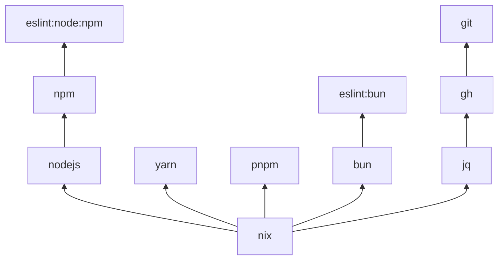

# TaskOtter

[](https://github.com/task-otter/store/actions/workflows/main.yml)
[](https://codecov.io/gh/task-otter/store)

Reusable, tested [Taskfile](https://taskfile.dev) modules for installing and running common dev tools. Each module lives under `taskfiles/<name>/` with a `Taskfile.yml`, `metadata.yml`, `README.md`, and Go tests.

## Quick start

### Standalone

```sh
task nix:install:profile NIX_INSTALLABLE=nixpkgs#go
task -t taskfiles/go/Taskfile.yml verify
```

### Included in your Taskfile

```yaml
includes:
  go: ./taskfiles/go/Taskfile.yml
  nix: ./taskfiles/nix/Taskfile.yml
```

Then run:

```sh
task nix:install:profile NIX_INSTALLABLE=nixpkgs#go
task go:verify
```

## Tools catalog

| Category | Modules | Count | Example |
| --- | --- | ---: | --- |
| Node runtimes | `nodejs`, `bun` | 2 | [`nodejs`](taskfiles/nodejs/README.md) |
| Package managers | `npm`, `pnpm`, `yarn` — flat nix-backed modules | 3 | [`npm`](taskfiles/npm/README.md) |
| JS lint/format/check | `biome`, `depcheck`, `eslint`, `htmlhint`, `knip`, `prettier`, `spectral`, `stylelint`, `typescript` — each a nested family with six modules (root, `bun`, `node`, and `node/{npm,pnpm,yarn}`) | 54 | [`eslint`](taskfiles/eslint/README.md) |
| Languages & runtimes | `go`, `golangci-lint`, `govulncheck`, `python`, `uv`, `cargo`, `proto`, `pulumi`, `nix` | 9 | [`go`](taskfiles/go/README.md) |
| CI & infra | `actionlint`, `bencher`, `bruno-cli`, `shellcheck`, `shfmt`, `yamlfix`, `yamllint`, `zizmor`, `hadolint`, `buf`, `docker`, `git`, `gh`, `jq`, `vault`, `ansible`, `ansible-lint`, `sqlfluff`, `dotenv-linter`, `djlint`, `jsonlint`, `rumdl`, `protolint`, `adrs` | 24 | [`actionlint`](taskfiles/actionlint/README.md) |
| Desktop & API clients | `bruno-gui` | 1 | [`bruno-gui`](taskfiles/bruno-gui/README.md) |

**93 modules** total. Per-module docs: `taskfiles/<name>/README.md`. Each module's
`metadata.yml` is a self-contained, machine-readable list of the tasks it exports.

Where a module documents `<TOOL>_LINT_SKIP_PATTERN` and/or
`<TOOL>_FMT_SKIP_PATTERN`, those vars default to empty. Not every linter
module exposes them — skip is owned by `config:skip` overlays or native
`--exclude` on the modules that document it. Patterns are matched against
forward-slash paths relative to the task working directory; `*` stays within
a path segment, `**` crosses directories, and `?` matches one character. For
example, `**/generated/**` skips generated files in any folder.

### Choosing a variant

Each JavaScript tool is a nested family. Include the family once
(`{tool}: taskfiles/{tool}/Taskfile.yml`), then invoke the leaf that matches your
runtime and package manager through its namespace:

```
task {tool}:bun:{task}                        # Bun runtime + Bun as package manager
task {tool}:node:{npm|pnpm|yarn}:{task}
```

For example: `task eslint:node:npm:lint`, `task prettier:bun:fmt:check`,
`task typescript:node:pnpm:build`.

Package-manager modules are flat nix-backed Taskfiles. Include once
(`npm: taskfiles/npm/Taskfile.yml`), then invoke directly:

```
task {npm|pnpm|yarn}:{task}
```

For example: `task npm:install`, `task pnpm:install:clean`, `task yarn:run SCRIPT=build`.
Node.js is installed via `nodejs:_ensure` (Nix profile).

## Dependencies

Modules compose via Taskfile `includes:`. A JS tool variant typically depends on a package-manager module, which in turn depends on a Node runtime stack.



See [deps-tree.md](deps-tree.md) for the complete dependency graph (forward and reverse views).

Keep [deps-tree.md](deps-tree.md) in sync when editing [`.deps.yml`](.deps.yml).

## Development

Validate all modules:

```sh
go test ./...
```

Each module README must include a `## Public Tasks` table listing every public task from its `Taskfile.yml`. Tests enforce this contract — run `go test ./...` after changing Taskfiles or READMEs.

After adding, removing, or renaming an exported task, update the corresponding
`metadata.yml` and run `go test ./...`.

### Test layers

Every Taskfile folder carries two Go test layers:

| Layer | File | What it does |
| --- | --- | --- |
| Contract | `<module>_test.go` | Parses `Taskfile.yml`, `metadata.yml` and `README.md` and checks what the module *declares*. |
| Integration | `integration_test.go` | Runs the real `task` CLI in that folder and checks what the module *does*. |

The integration layer is one line per folder — it delegates to the shared suite
in [`internal/taskintegration`](internal/taskintegration):

```go
func TestModuleIntegration(t *testing.T) {
	t.Parallel()

	taskintegration.RunHere(t)
}
```

The suite loads the Taskfile through `task --list-all --json`, checks the CLI
and the Taskfile agree in both directions, checks every task `metadata.yml`
advertises is reachable (including under each variant namespace), renders
`task --summary` for every declared task, runs the module's `default` task, and
requires an unknown task name to fail. Every run happens in an isolated `HOME`,
and nothing is installed or downloaded.

A module can opt individual tasks into `task --dry` by calling `RunSpec`
instead:

```go
taskintegration.RunSpec(t, &taskintegration.Spec{
	Module:      "docker",
	DryRunTasks: []string{"version"},
})
```

`TestEveryTaskfileFolderHasAnIntegrationTest` in
[`taskfiles/integration_coverage_test.go`](taskfiles/integration_coverage_test.go)
fails when a new Taskfile folder ships without one. See
[doc/adr/0003-run-every-taskfile-folder-through-the-task-cli-in-tests.md](doc/adr/0003-run-every-taskfile-folder-through-the-task-cli-in-tests.md).

Top-level Taskfile vars must use an owned `{TOOL}_` prefix (or a
foreign/companion prefix); see
[doc/adr/0002-prefix-top-level-taskfile-vars-with-the-module-name.md](doc/adr/0002-prefix-top-level-taskfile-vars-with-the-module-name.md).
